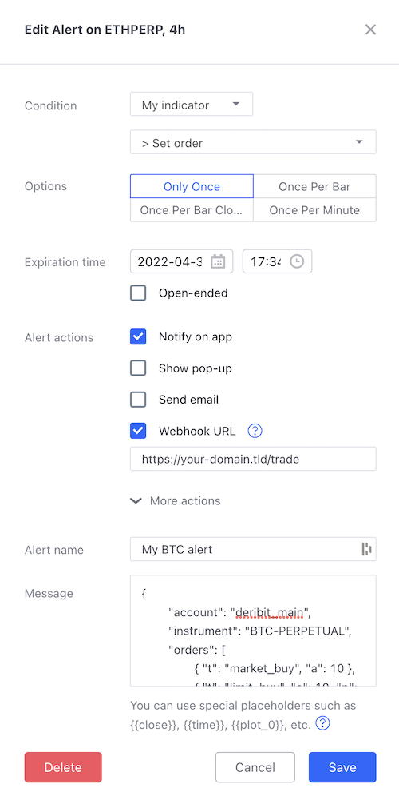

# docker-tradingview-trader

This nodejs project allows you to execute trades from Tradingview alerts on most crypto exchanges.

### Usage

* copy `config.json.sample` to `config.json` and fill in the required information
	* `name` is the alias for the exchange (you can have multiple aliases/accounts on 1 exchange)
	* `exchange` is the exchange `id` used in [`ccxt` library](https://github.com/ccxt/ccxt/wiki/Exchange-Markets)
	* `key` & `secret` refer to the API keys you have to generate on each exchange
* mount this config file in your docker container, ideally using `docker-compose.yml`

### Tradingview alert message

Tradingview `Webhook URL` must be set to `https://{your-hostname.tld}/trade`
Read the following sections to understand how to fill the `Message` field.

<div align="center">



</div>

#### Real-life example

```
{
	"account": "deribit_main",
	"instrument": "BTC-PERPETUAL",
	"orders": [
		{ "t": "market_buy", "a": 10 },
		{ "t": "limit_buy", "a": 10, "p": 35000 },
		{ "t": "stop_market_sell", "a": 20, "p": 30000 }
	]
}
``` 

This example will open a market position, place a limit buy order, and set a stop order.

**Note: JSON must be valid in order to be executed. You can check format using [JSONLint](https://jsonlint.com/).**

### Params description and requirement for each order type

* `t` order **type**
* `a` **amount** to buy or sell
* `p` **price** at which to place order
* `u` **upper** price for a scaled order
* `l` **lower** price for a scaled order

|                    t |  a  |  p  |  u  |  l  |  n  |
|---------------------:|:---:|:---:|:---:|:---:|:---:|
|        **limit_buy** |  x  |  x  |     |     |     |
|       **limit_sell** |  x  |  x  |     |     |     |
|       **scaled_buy** |  x  |     |  x  |  x  |  x  |
|      **scaled_sell** |  x  |     |  x  |  x  |  x  |
|       **market_buy** |  x  |     |     |     |     |
|      **market_sell** |  x  |     |     |     |     |
|  **stop_market_buy** |  x  |  x  |     |     |     |
| **stop_market_sell** |  x  |  x  |     |     |     |
|   **close_position** |  x  |  x  |     |     |     |


### Endpoints

* `POST /trade` to place trades from tradingview
* `GET /exchanges` to list supported exhanges, useful to find a `ccxt id` 
* `GET /exchanges/:exchange` to list available instruments (symbols) for a specific exchange

